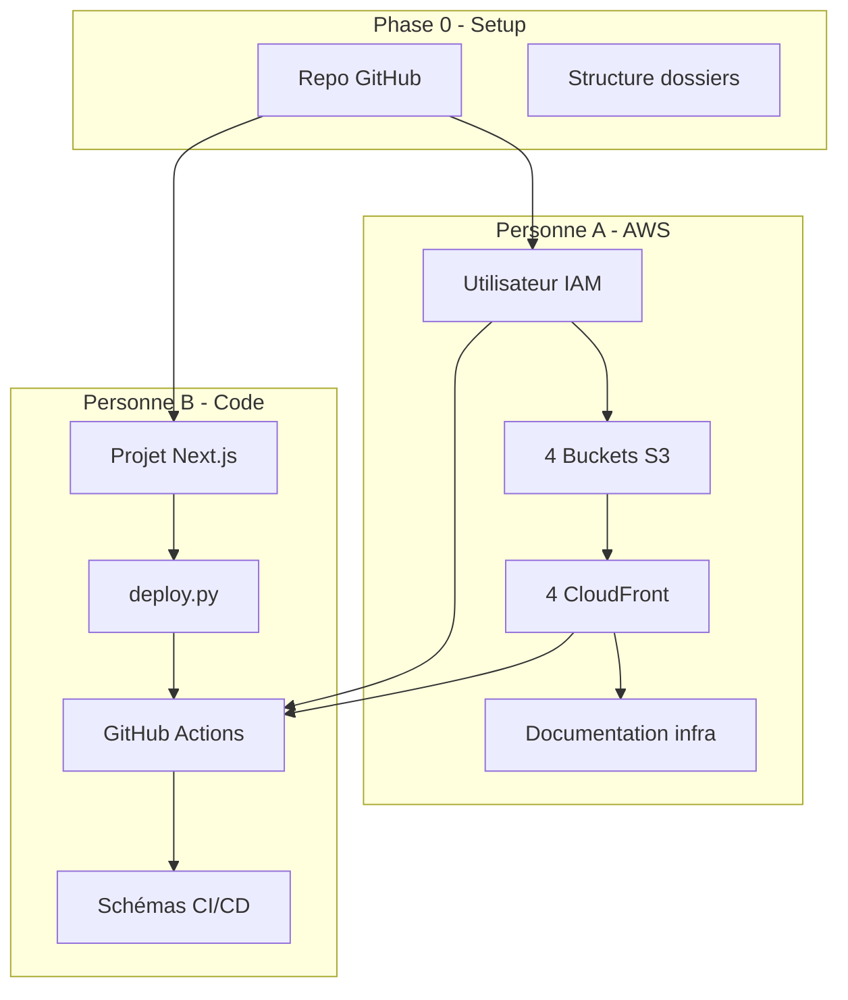

# Plans détaillés — Déploiement sur AWS (GitHub)

Projet à deux : **Personne A** = AWS / Infrastructure · **Personne B** = Code / Frontend / CI/CD  
Stack : Next.js · GitHub Actions · S3 · CloudFront · Python (script de déploiement)

---

# Plan 1 — AWS (Personne A)

## Vue d'ensemble

La personne A est responsable de toute l'infrastructure AWS : création des buckets S3, distributions CloudFront, utilisateur IAM pour la CI, et documentation. Aucune modification de code applicatif.

---

## Phase 0 — Prérequis et compte AWS

### Créer ou utiliser un compte AWS

- Se connecter à [console.aws.amazon.com](https://console.aws.amazon.com)
- Vérifier que le compte est actif (Free Tier possible pour le projet)
- Choisir la région : **eu-west-1** (Irlande) ou **eu-west-3** (Paris) — à décider ensemble et à documenter partout

### Comprendre les services utilisés

- **S3** : stockage des fichiers statiques (HTML, JS, CSS du build Next.js)
- **CloudFront** : CDN pour servir le site avec HTTPS et invalidation de cache
- **IAM** : utilisateur dédié pour GitHub Actions avec droits minimaux

---

## Phase 1 — Utilisateur IAM pour la CI (Partie 2–4 du PDF)

### Objectif

Créer un utilisateur IAM `ci-deployer` utilisé uniquement par GitHub Actions. Jamais de clés root.

### Étapes détaillées

1. **Créer l'utilisateur**

- IAM > Users > Create user
- Nom : `ci-deployer`
- Ne pas cocher "Provide user access to the AWS Management Console"
- Next

1. **Attacher une policy inline (droits minimaux)**
   Créer une policy inline avec le JSON suivant :

```json
{
  "Version": "2012-10-17",
  "Statement": [
    {
      "Effect": "Allow",
      "Action": [
        "s3:PutObject",
        "s3:DeleteObject",
        "s3:ListBucket",
        "s3:GetObject"
      ],
      "Resource": ["arn:aws:s3:::*"]
    },
    {
      "Effect": "Allow",
      "Action": ["cloudfront:CreateInvalidation"],
      "Resource": "*"
    }
  ]
}
```

- Users > ci-deployer > Add permissions > Create inline policy
- Onglet JSON > coller le JSON > Next > Nom : `ci-deploy-s3-cloudfront` > Create

1. **Générer les Access Keys**

- Users > ci-deployer > Security credentials > Create access key
- Use case : "Application running outside AWS"
- Créer et **noter immédiatement** :
  - `AWS_ACCESS_KEY_ID`
  - `AWS_SECRET_ACCESS_KEY`
- Ces valeurs seront ajoutées dans GitHub Secrets par B (ne jamais les committer)

1. **Documenter dans le repo**

- Créer `infra/iam-policy.json` avec uniquement la policy (sans les clés)
- Ajouter une note dans `infra/README.md` : "Les clés IAM sont dans GitHub Secrets"

---

## Phase 2 — Buckets S3 (Partie 1 et 4 du PDF)

### Objectif

4 buckets : user-dev, user-prd, admin-dev, admin-prd. Chaque bucket héberge un frontend statique.

### Convention de nommage

Remplacer `monprojet` par le nom réel du projet (ex. `cloud-serverless-iimb3`) :

| Bucket                | Usage                    |
| --------------------- | ------------------------ |
| `monprojet-user-dev`  | Front User — Staging     |
| `monprojet-user-prd`  | Front User — Production  |
| `monprojet-admin-dev` | Front Admin — Staging    |
| `monprojet-admin-prd` | Front Admin — Production |

### Pour chaque bucket (répéter 4 fois)

1. **Créer le bucket**

- S3 > Create bucket
- Bucket name : nom unique global (ex. `cloud-serverless-iimb3-user-dev`)
- Region : celle choisie (ex. `eu-west-1`)
- **Block all public access** : **décocher** (on assume la responsabilité)
- Cocher "I acknowledge that the current settings might result in this bucket and the objects within it becoming public"
- Create bucket

1. **Activer le Static website hosting**

- Bucket > Properties > Static website hosting > Edit
- Enable
- Index document : `index.html`
- Error document : `index.html` (pour le routing SPA)
- Save changes
- Noter l'URL "Bucket website endpoint" (format : `bucket.s3-website.region.amazonaws.com`)

1. **Bucket policy pour accès public en lecture**

- Bucket > Permissions > Bucket policy > Edit
- Coller (remplacer `NOM-DU-BUCKET` et `REGION` si besoin) :

```json
{
  "Version": "2012-10-17",
  "Statement": [
    {
      "Sid": "PublicReadGetObject",
      "Effect": "Allow",
      "Principal": "*",
      "Action": "s3:GetObject",
      "Resource": "arn:aws:s3:::NOM-DU-BUCKET/*"
    }
  ]
}
```

- Save changes

1. **Documenter**

- Remplir `infra/buckets.md` avec : nom, région, website endpoint pour chaque bucket

---

## Phase 3 — Distributions CloudFront (Partie 1 et 4 du PDF)

### Objectif

4 distributions CloudFront, une par bucket. HTTPS, cache, et gestion des erreurs 403/404 pour le SPA.

### Pour chaque distribution (répéter 4 fois)

1. **Créer la distribution**

- CloudFront > Create distribution

1. **Origin**

- **Origin domain** : choisir le bucket S3 **mais** ne pas utiliser l'URL automatique type `bucket.s3.amazonaws.com`
- Utiliser l'URL du **website endpoint** : `NOM-DU-BUCKET.s3-website.REGION.amazonaws.com`
- Origin path : laisser vide
- Name : auto-généré (ex. `S3-website-bucket.s3-website-eu-west-1.amazonaws.com`)

1. **Default cache behavior**

- Viewer protocol policy : **Redirect HTTP to HTTPS**
- Allowed HTTP methods : GET, HEAD, OPTIONS
- Cache policy : CachingOptimized (ou CachingDisabled pour dev si souhaité)

1. **Settings**

- Default root object : `index.html`
- Alternate domain names (CNAMEs) : laisser vide (on utilise l'URL CloudFront)
- SSL certificate : Default CloudFront certificate

1. **Error pages (crucial pour SPA)**

- Error pages > Create custom error response
- HTTP error code : **403**
- Response page path : `/index.html`
- HTTP response code : **200**
- Create
- Répéter pour **404** : même configuration

1. **Créer**

- Create distribution
- Noter le **Distribution ID** et l'**URL** (format `xxxxx.cloudfront.net`)

### Documenter

- Remplir `infra/cloudfront-urls.md` :

```markdown
| Environnement | Front | URL CloudFront             | Distribution ID |
| ------------- | ----- | -------------------------- | --------------- |
| dev           | user  | https://xxx.cloudfront.net | E1234...        |
| dev           | admin | https://yyy.cloudfront.net | E5678...        |
| prd           | user  | ...                        | ...             |
| prd           | admin | ...                        | ...             |
```

---

## Phase 4 — Checklist de nettoyage (exigence PDF)

### Créer `infra/cleanup-checklist.md`

Liste exhaustive de tout ce qui doit être supprimé dans la semaine suivant le rendu :

- 4 distributions CloudFront (attendre "Disabled" avant suppression)
- 4 buckets S3 (vider avant de supprimer)
- Utilisateur IAM `ci-deployer` et ses access keys
- Vérifier Cost Explorer : 0 $ de facturation

**Important** : Le PDF exige explicitement la suppression de toutes les ressources AWS sous 7 jours.

---

## Phase 5 — Schéma Draw.io (Partie 5 du PDF)

### Schéma infrastructure AWS

- Ouvrir [app.diagrams.net](https://app.diagrams.net)
- Utiliser les icônes AWS (Shape library > AWS)
- Schématiser :
  - GitHub repo → GitHub Actions
  - GitHub Actions → 4 buckets S3 (avec distinction dev/prd, user/admin)
  - 4 buckets S3 → 4 distributions CloudFront
  - Utilisateurs → CloudFront (accès au site)
  - Couleurs : bleu pour dev, vert pour prd
- Exporter en PNG
- Sauvegarder le fichier source dans `docs/schema-aws.drawio`

---

## Récapitulatif des livrables A

| Fichier                      | Contenu                                |
| ---------------------------- | -------------------------------------- |
| `infra/iam-policy.json`      | Policy IAM (sans clés)                 |
| `infra/buckets.md`           | Noms, régions, endpoints des 4 buckets |
| `infra/cloudfront-urls.md`   | URLs et IDs des 4 distributions        |
| `infra/cleanup-checklist.md` | Liste des ressources à supprimer       |
| `docs/schema-aws.drawio`     | Schéma infra AWS                       |

---

# Plan 2 — Code et GitHub (Personne B)

## Vue d'ensemble

La personne B gère le projet Next.js, la structure du repo, les scripts de déploiement, les workflows GitHub Actions, et les schémas CI/CD. Coordination avec A pour les noms de buckets et IDs CloudFront.

---

## Phase 0 — Setup initial du repo (avec A)

### Créer le repository GitHub

- Créer un repo **public** sur GitHub
- Nom suggéré : `cloud-serverless-iimb3` (ou équivalent)
- Ne pas initialiser avec README si on a déjà du contenu local

### Branches et conventions

- Branches principales :
  - `main` → production (déploiement prd)
  - `dev` → staging (déploiement dev)
- Branches de travail : `feature/nom` ou `fix/nom` → PR vers `dev`
- Convention : jamais de push direct sur `main` sans PR validée

### Structure des dossiers

```
repo/
├── code/                 # Projet Next.js
├── scripts/              # deploy.py, requirements.txt
├── infra/                # Doc AWS (rempli par A)
├── docs/                 # Schémas draw.io
├── .github/
│   └── workflows/        # deploy-dev.yml, deploy-prd.yml
├── .gitignore
└── README.md
```

### .gitignore

```
node_modules/
.next/
out/
.env*
*.pyc
__pycache__/
.DS_Store
*.log
```

### README.md (structure minimale)

- Section URLs (à remplir après déploiement)
- Section GitHub Secrets (liste des secrets requis)
- Section Cleanup (lien vers infra/cleanup-checklist.md)

---

## Phase 1 — Projet Next.js (Partie 1 du PDF)

### Initialisation

- Dans `code/` : `npx create-next-app@latest . --typescript --tailwind --eslint --app`
- Vérifier : `npm run dev` → site accessible en local

### Export statique (obligatoire pour S3)

- Modifier `code/next.config.js` :

```js
/** @type {import('next').NextConfig} */
const nextConfig = {
  output: "export",
  trailingSlash: true,
  images: { unoptimized: true },
};
module.exports = nextConfig;
```

- `npm run build` → dossier `out/` généré avec HTML, JS, CSS

### Structure user / admin (cahier des charges PDF)

- Route groups dans `app/` :

```
  app/
  ├── (user)/
  │   ├── layout.tsx
  │   └── page.tsx
  └── (admin)/
      ├── layout.tsx
      └── page.tsx


```

- Contenu minimal distinct sur chaque page ("Front User" / "Front Admin")
- Deux builds possibles : un pour user, un pour admin — ou un seul build avec les deux routes (selon choix d'architecture). Le plan actuel suppose un build unique avec routing.

### Variables d'environnement (Partie 4 du PDF)

- Créer `.env.development` et `.env.production` (dans `code/`)
- Contenu type :
  - `NEXT_PUBLIC_ENV=development` / `production`
  - `NEXT_PUBLIC_API_URL=...`
- S'assurer que `.env*` est dans `.gitignore`
- Les variables ne doivent **jamais** être committées

### ESLint (Partie 3 du PDF)

- Vérifier `.eslintrc.json` (créé par Next.js)
- `npm run lint` doit retourner exit 1 en cas d'erreur
- Tester en introduisant une erreur volontaire

---

## Phase 2 — Script de déploiement (Partie 2 du PDF)

### deploy.py

- Créer `scripts/requirements.txt` : `boto3>=1.26.0`
- Créer `scripts/deploy.py` avec les étapes :
  1. `npm install` (ou `npm ci`) dans `code/`
  2. `npm run build` dans `code/`
  3. Vider le bucket S3 cible
  4. Uploader le contenu de `code/out/` vers S3 (avec Content-Type correct)
  5. Invalidation CloudFront `/` pour vider le cache

### Variables d'environnement du script

Le script doit lire :

- `S3_BUCKET_USER_DEV`, `S3_BUCKET_USER_PRD`
- `S3_BUCKET_ADMIN_DEV`, `S3_BUCKET_ADMIN_PRD`
- `CF_ID_USER_DEV`, `CF_ID_USER_PRD`
- `CF_ID_ADMIN_DEV`, `CF_ID_ADMIN_PRD`

(ou variante avec un seul front par env si on ne déploie qu'un build)

### Test local

- Configurer les variables d'env en local
- `python scripts/deploy.py dev`
- Modifier un texte sur le front, redéployer, vérifier que le changement apparaît immédiatement (cache CloudFront invalidé)

---

## Phase 3 — GitHub Actions CI/CD (Parties 2, 3, 4 du PDF)

### Secrets GitHub

- Settings > Secrets and variables > Actions > New repository secret
- Ajouter :
  - `AWS_ACCESS_KEY_ID`
  - `AWS_SECRET_ACCESS_KEY`
  - `AWS_REGION`
  - `S3_BUCKET_USER_DEV`, `S3_BUCKET_USER_PRD`
  - `S3_BUCKET_ADMIN_DEV`, `S3_BUCKET_ADMIN_PRD`
  - `CF_ID_USER_DEV`, `CF_ID_USER_PRD`
  - `CF_ID_ADMIN_DEV`, `CF_ID_ADMIN_PRD`

### Workflow deploy-dev.yml

- Déclencheur : `push` sur `dev`
- Étapes :
  1. Checkout
  2. Setup Node.js 20 + cache npm
  3. Setup Python 3.11
  4. `pip install -r scripts/requirements.txt`
  5. **Lint** : `cd code && npm ci && npm run lint` — **le pipeline doit s'arrêter si échec** (Partie 3)
  6. Deploy : exécuter `deploy.py` avec les secrets dev

### Workflow deploy-prd.yml

- Déclencheur : `push` sur `main`
- Même structure que deploy-dev, avec secrets prd

### Test de la CI (Partie 3)

- Introduire une erreur de lint
- Push sur `dev`
- Vérifier que le job échoue sur l'étape Lint
- Corriger, repousser, vérifier succès complet

---

## Phase 4 — Multi-environnements (Partie 4 du PDF)

- Vérifier que `NEXT_PUBLIC_ENV` est différent selon l'env (visible dans l'UI)
- Adapter `deploy.py` si besoin pour user + admin (deux buckets par env)
- S'assurer qu'aucune variable sensible n'est dans le code
- Remplir le tableau d'URLs dans le README

---

## Phase 5 — Schéma CI/CD (Partie 5 du PDF)

- Draw.io : schéma du pipeline
  - Push dev/main
  - Checkout → Setup Node/Python → Lint (stop si fail) → Build → Clear S3 → Upload → CloudFront invalidation
- Exporter PNG + sauvegarder `docs/schema-cicd.drawio`

---

## Récapitulatif des livrables B

| Fichier                            | Contenu                |
| ---------------------------------- | ---------------------- |
| `code/`                            | Projet Next.js complet |
| `scripts/deploy.py`                | Script de déploiement  |
| `scripts/requirements.txt`         | boto3                  |
| `.github/workflows/deploy-dev.yml` | CI/CD dev              |
| `.github/workflows/deploy-prd.yml` | CI/CD prd              |
| `docs/schema-cicd.drawio`          | Schéma pipeline        |

---

# Coordination A / B

## Points de synchronisation

1. **Phase 0** : Création du repo et structure ensemble
2. **Après Phase 1 A** : A transmet à B les noms de buckets et IDs CloudFront pour les secrets
3. **Phase 3 (premier déploiement manuel)** : B fait le build, A upload manuellement pour validation
4. **Phase 6** : Vérification commune des 4 environnements
5. **Phase 7** : Validation des schémas

## Ordre recommandé

- A et B peuvent travailler en parallèle sur Phases 1–2
- Phase 3 nécessite que A ait créé au moins un bucket + CloudFront
- Phase 5 (workflows) nécessite que A ait fourni les IDs et que B ait les secrets

---

# Diagramme de dépendances



---

# Checklist finale (exigences PDF)

- Repo GitHub public (pas GitLab)
- URL CloudFront Front User (dev + prd)
- URL CloudFront Front Admin (dev + prd)
- CI/CD fonctionnelle avec lint bloquant
- Variables d'env jamais dans le code
- Schémas draw.io dans docs/
- README avec toutes les URLs
- Vidéo de démo 10 min max
- Ressources AWS supprimées sous 7 jours
